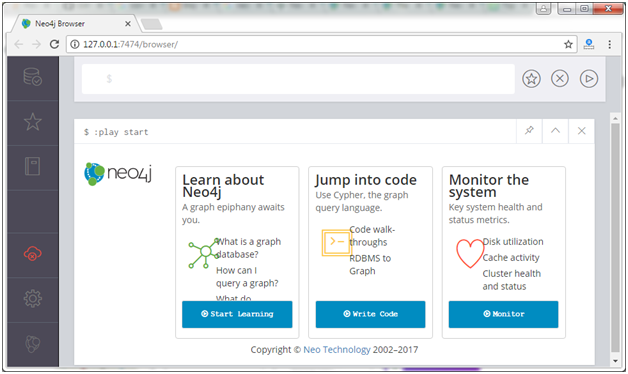

# Installation
* Downloan Neo4J - https://neo4j.com/download/
* Extract zip
* Go to bin directory in extracted folder. For example: C:\...\neo4j\neo4j-community-4.4.10-windows\neo4j-community-4.4.10\bin
* Run command
```
neo4j console
```
* Open url - http://localhost:7474
* Should see Neo4J runniung\

