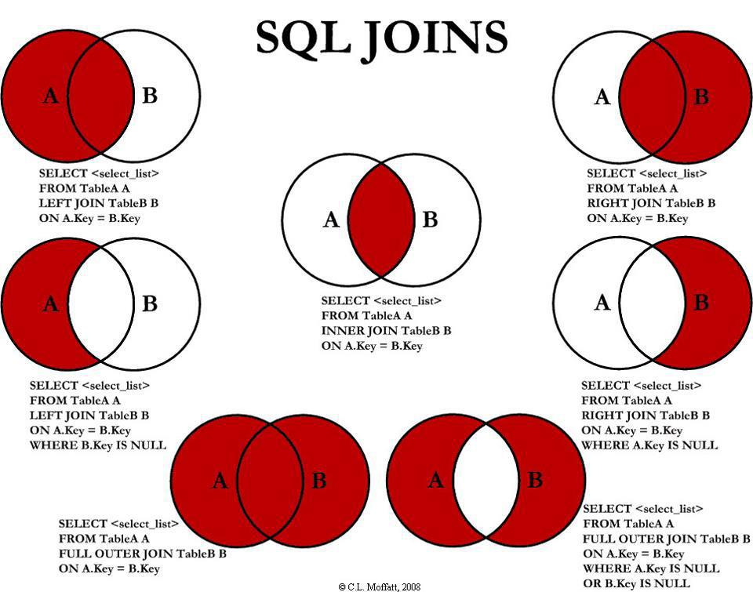
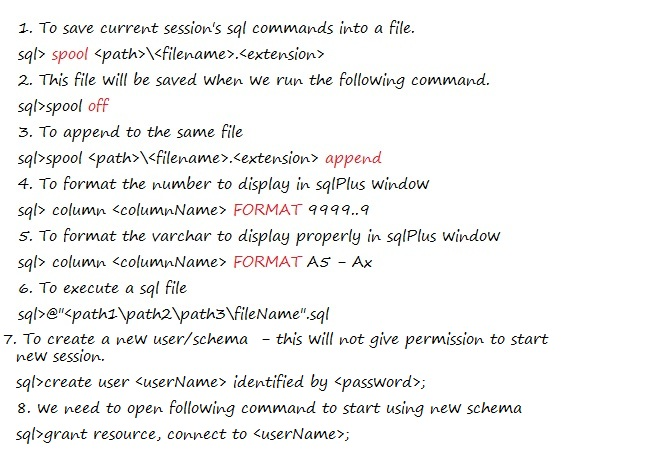

# Notes

# Steps in Setting up databases
*Database design
	* ER Diagram
	* Relational Schema
* Create database
* Update database
* DBA
	* Regular health and maintenence of database
* Table name with columns - Relational Schema
* Relational schema with relations is Database schema

# what is sql?
* Structured Query Language designed to work with databases
* Allows
	* Create
	* Manipulate
	* Share
* SQL language is used to define and manuplate data in SQL databases
* For complex queries SQL best fit with features like joins
* Declarative language
	* Not on how the implementation is done
	* Focus is on what results we want to get

# Query
* Piece of code inducing the computer to execute certain operation that will delivery desired output

# Some SQL Platforms/Databases
* MySQL
* Oracle
* PostgreSql
* Sql Server
* SQLite
* MariaDB
* Microsoft Access

# Joins


# SQL Commands


# Normal Forms
* First Normal Form
	* No repeating elements or groups of elements
* Second Normal Form
	* No partial dependencies on composite primary key
* Third Normal Form
	* No dependencies on non-key attributes
	
# Components of Sql
* DDL - Data Definition Language
* DML - Data Manipulation Language
* DCL- Data Control Language
* TCL - Transaction Control Language

# DDL Create Statement
* Syntax
```
create table object_name(column_name data_type);
```
* Example
```
create table sales(purchase_number int);
```

# DDL Alter Statement
* Add column
```
alter table sales add column date_of_purchase date;
```

# DDL Drop Statement
* Drop table
```
drop table sales;
```

# DDL Rename statement
* Remane table
```
rename table customers to customer_data;
```

# DDL Truncate statement
* Delete all records from customer table
```
truncate table customers;
```

# Relationships
* One-to-Many
* Many-to-One
* One-to-One
* Many-to-Many
------
# DCL Data Control Language statements
* Grant
* Revoke

# Grant
* Syntax
```
grant type_of_permission on database_name.table_name to 'username'@'localhost'
```
------
# Transaction Control Language
* Not every change make to database is saved automatically

# Statements
* commit
* rollback

# Commit
* Works for `insert`, `update`, `delete` clauses
* will save changes perminantly

# rollback
* will revert to last committed stage
* syntax
```
rollback;
```