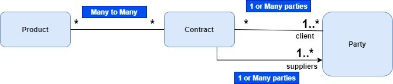
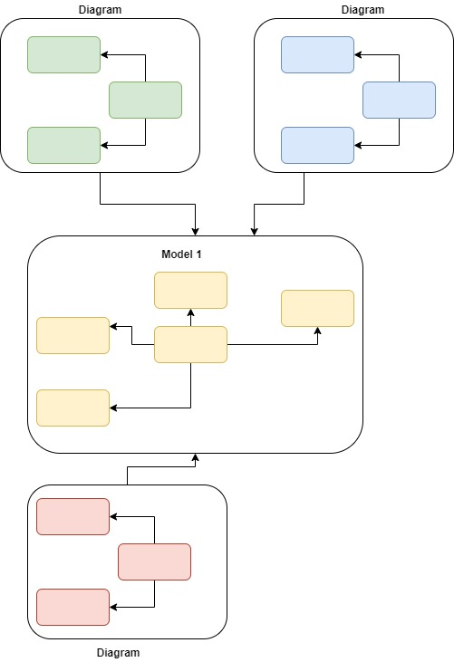
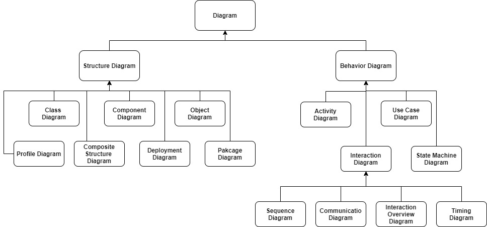
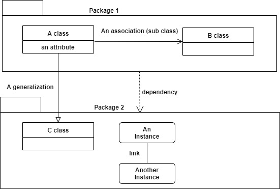
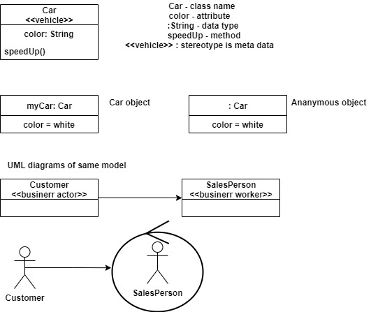
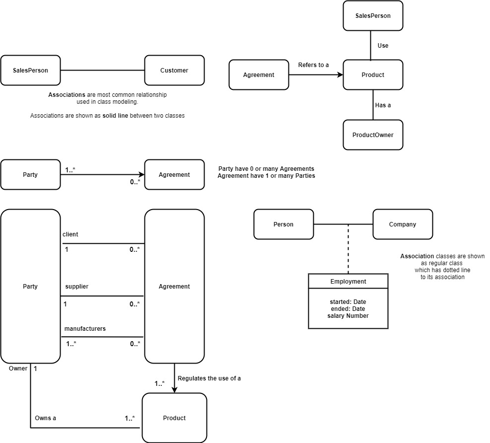

# Conceptual map
* UML Notations\

# Why we model?
* To understand very complex problem/requirements

# What is conceptual domain model?
* Encapsulated expert's knowledge

# What is business domain model?
* Language and concepts business persons use

# What is Model in UML?
* There are 3 categories of elements
	* Classifiers
	* Events
	* Behaviors
* Classifiers
	* Set of objects
	* object is individual thing with state and relationships to other objects
* Events
	* Set of possible occurences
	* something that happens that has some consequence with in the system
* Behaviors
	* set of possible executions
	* execution is performance of an algorithm according to set of rules\

# UML Diagrams

# Class diagram

# Classes and instances

# Lines and Links and Symbols

# Generalization
